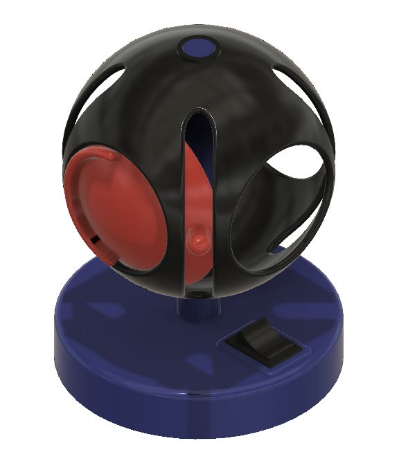
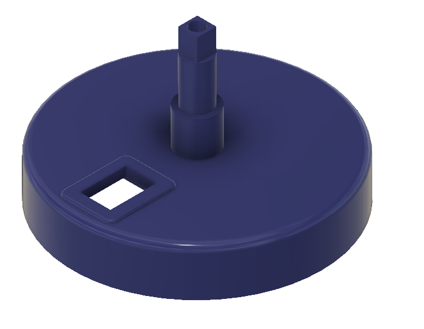
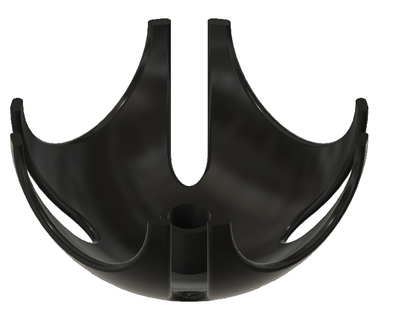
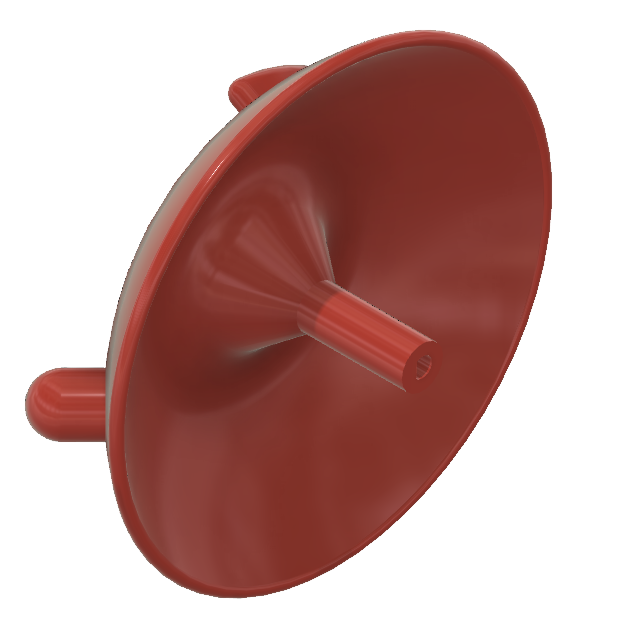
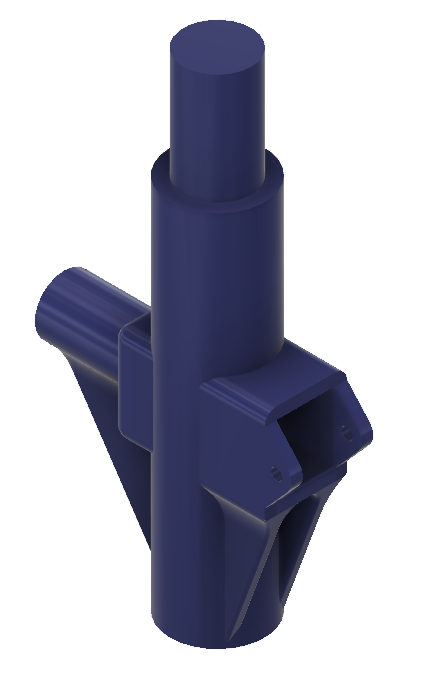
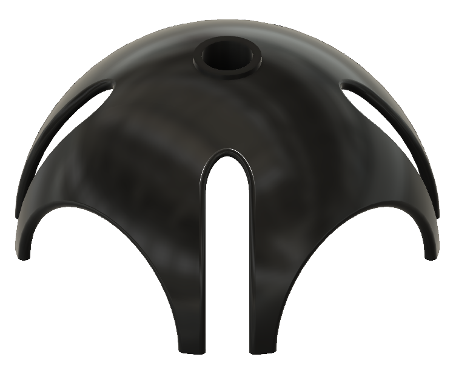
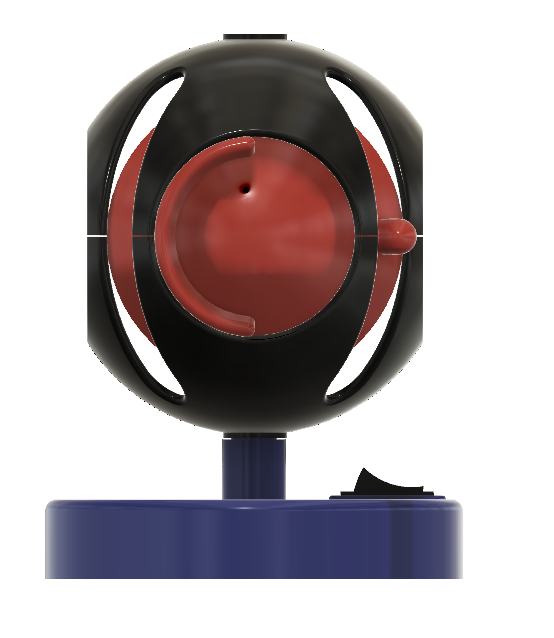
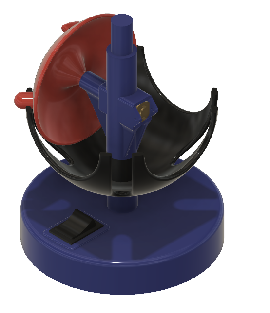
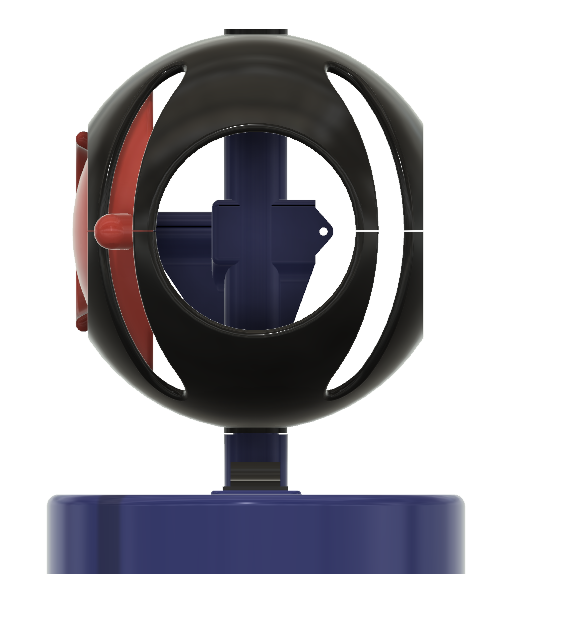

# Geneva Gear

Kinetic Art.

Double geneva gear in spherical shape.

Inspiration [https://youtu.be/jQC7nJW7kss​](https://youtu.be/jQC7nJW7kss​).

## Video

Find a [video](https://www.youtube.com/watch?v=VGC3ukFFIMQ) here.

## Hardware

- [Motor](https://nl.aliexpress.com/item/32891710985.html) - pay attention to RPM (30, 60, 120, ...) and voltage (3V, 6V, 12V)
- [Switch](https://nl.aliexpress.com/item/32921026422.html)
- Battery box [AAA](https://nl.aliexpress.com/item/4001080222745.html) or [AA](https://nl.aliexpress.com/item/1005002137109137.html)

## STL files

- [Base](Base.stl)            
- [Bottom Cup](BottomCup.stl) 
- [Dial](Dial.stl)            
- [Heart](Heart.stl)          
- [TopCup](TopCup.stl)        

## Assembly

(end)
