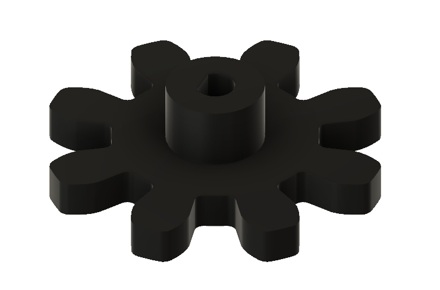
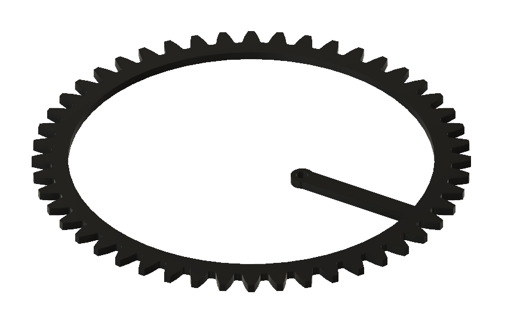
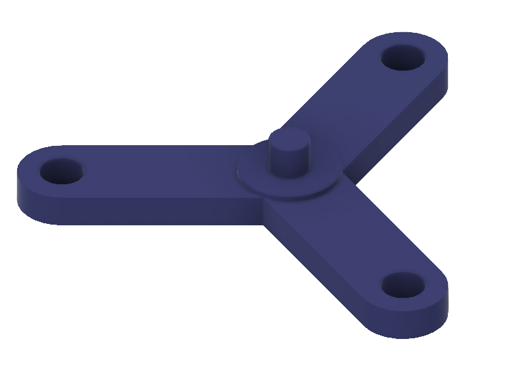
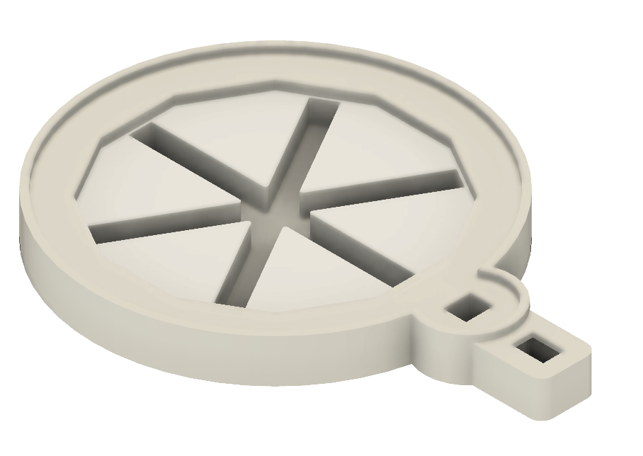
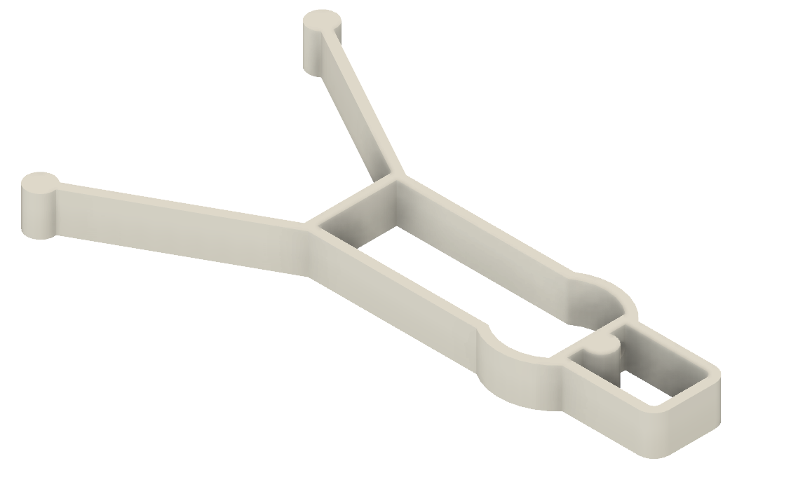
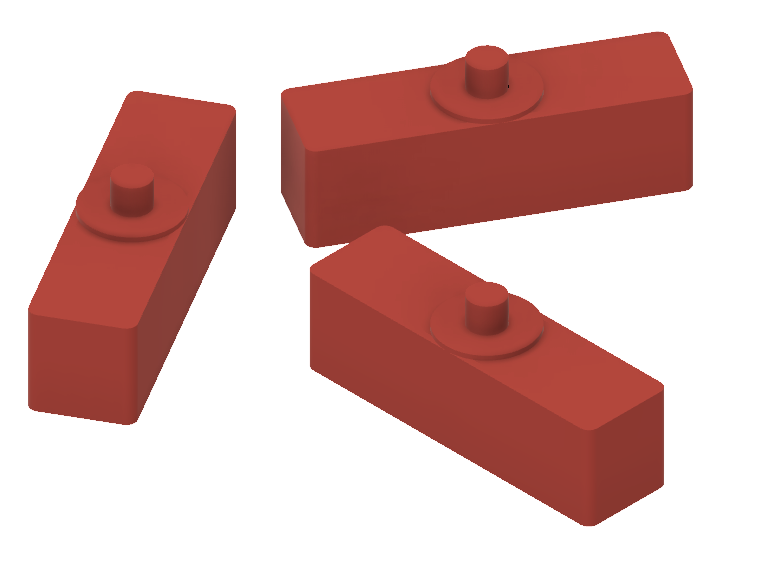
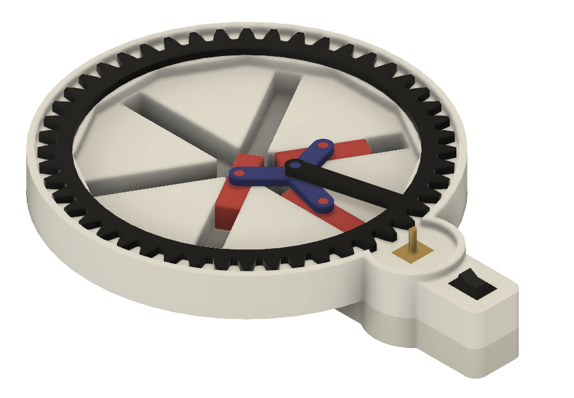
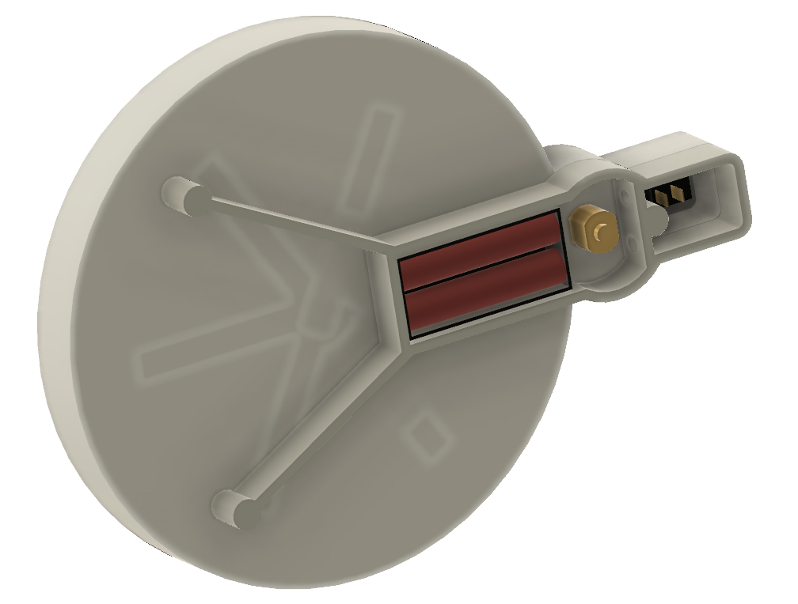

# Hex Grinder

Kinetic Art. 

A 6-way motorized Nothing Grinder. 

Inspiration from a video by [Mathologer](https://youtu.be/7Fn-26Jmi5E​). 

## Video

Find a [video](https://www.youtube.com/watch?v=LN3e6v9pYDQ) here.

## Hardware

- [Motor](https://nl.aliexpress.com/item/32891710985.html) - pay attention to RPM (30, 60, 120, ...) and voltage (3V, 6V, 12V)
- [Switch](https://nl.aliexpress.com/item/32921026422.html)
- Battery box [AAA](https://nl.aliexpress.com/item/4001080222745.html) or [AA](https://nl.aliexpress.com/item/1005002137109137.html)

## STL files

- [Drive Gear (8 teeth)](DriveGear8teeth.stl)   
- [Wheel Gear (48 teeth)](WheelGear48teeth.stl) 
- [Arm](Arm.stl)                                
- [Base](Base.stl)                              
- [Foot](Foot.stl)                              
- [Slider 3x](Slider3x.stl)                     

## Assembly

(end)

