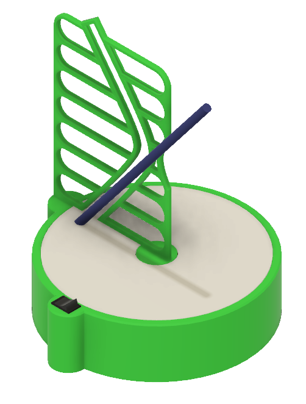
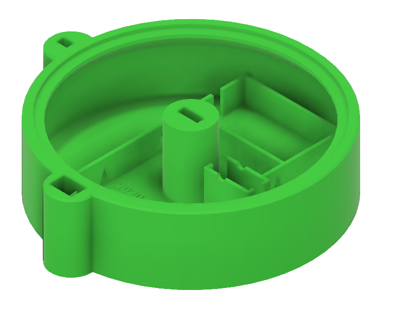
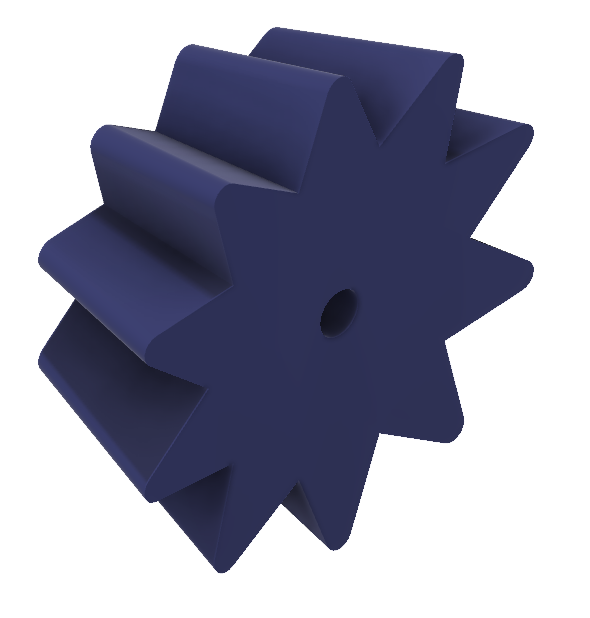
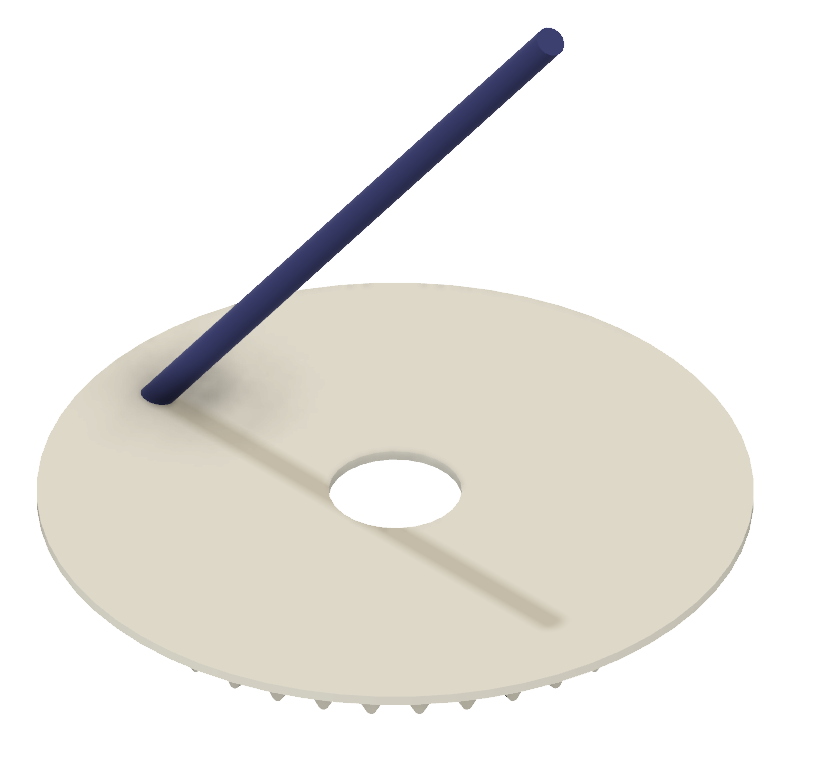
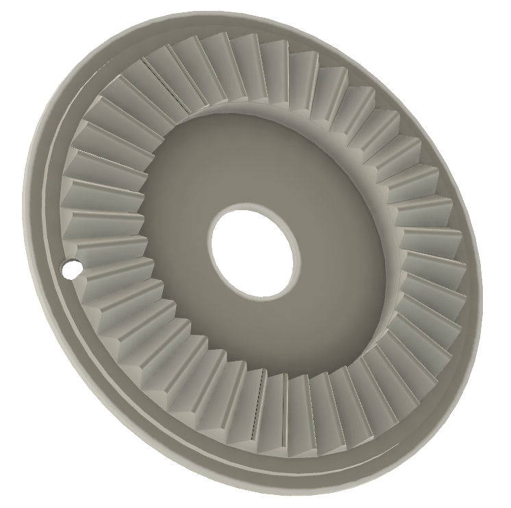
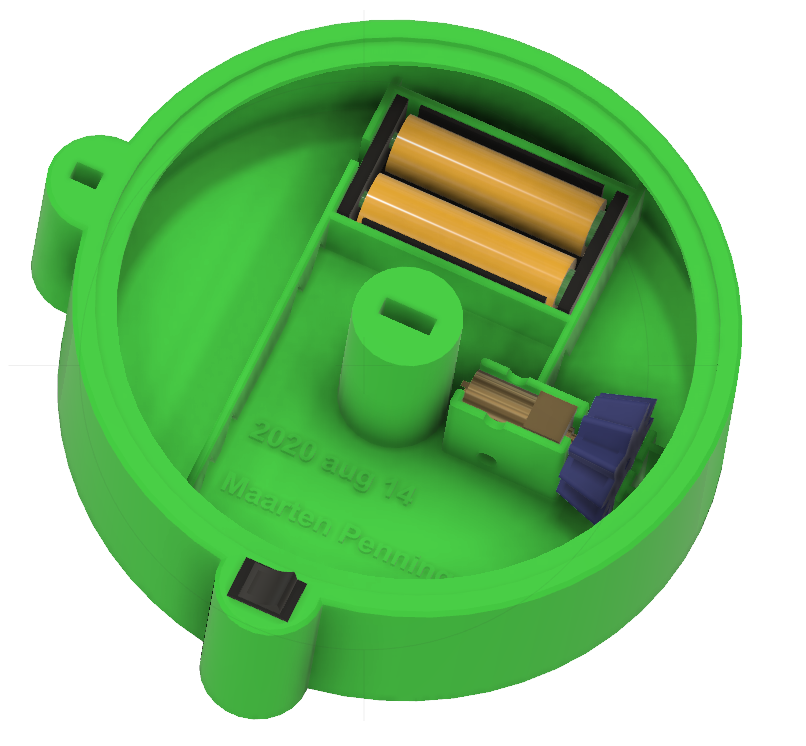

# Hyberbola hole

Kinetic Art. 

A 6-way motorized Nothing Grinder. 

Inspiration from a video by [Make anything](https://www.youtube.com/watch?v=Gm-lCSPBdp4). 

## Video

Find a [video](https://www.youtube.com/watch?v=ZJOfedf6yPU) here or [here](https://www.youtube.com/watch?v=eTKZIih0rUA).

## Hardware

- [Motor](https://nl.aliexpress.com/item/32891710985.html) - pay attention to RPM (30, 60, 120, ...) and voltage (3V, 6V, 12V)
- [Switch](https://nl.aliexpress.com/item/32921026422.html)
- Battery box [AAA](https://nl.aliexpress.com/item/4001080222745.html) or [AA](https://nl.aliexpress.com/item/1005002137109137.html)

## STL files

- [Box](Box.stl)                  
- [Drive Gear](DriveGear.stl)     
- [Grate](Grate.stl)              
- [Pole](Pole.stl)                
- [Table](Table.stl)              

## Assembly

(end)

