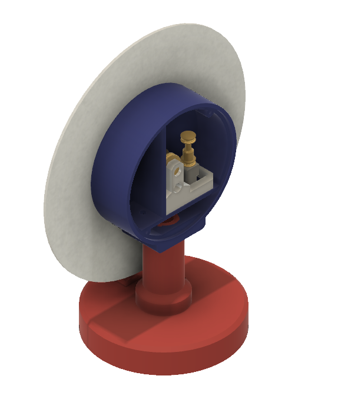
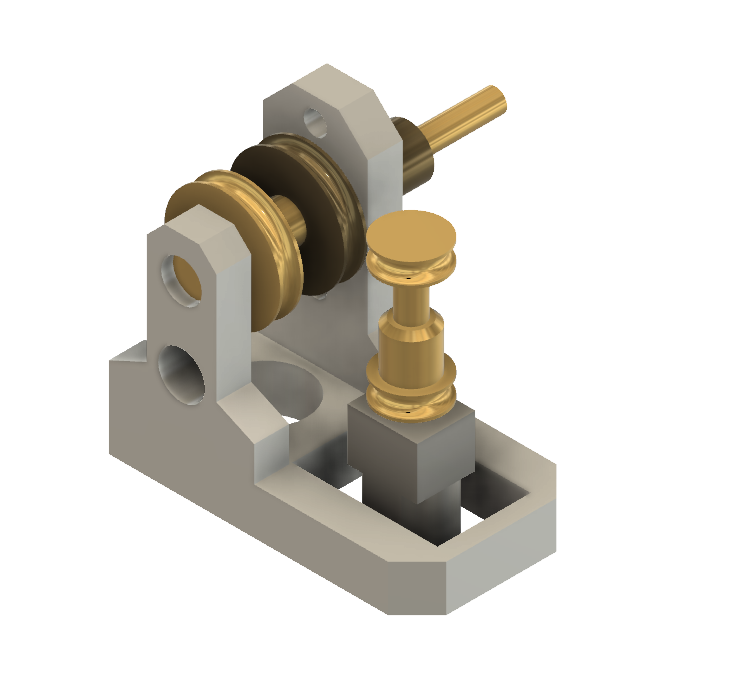
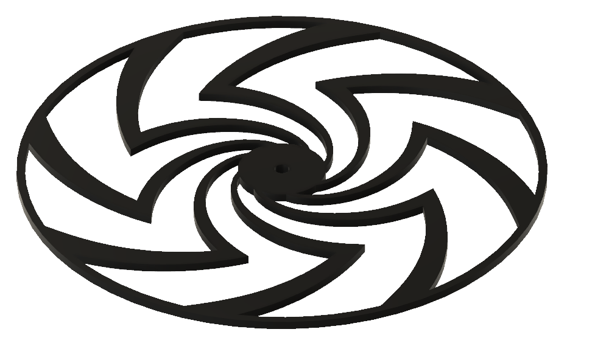
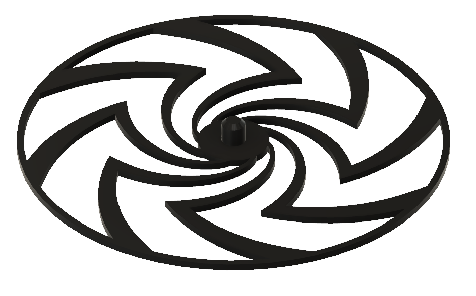
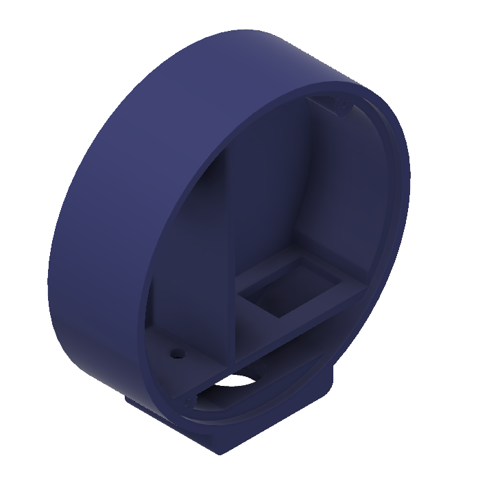
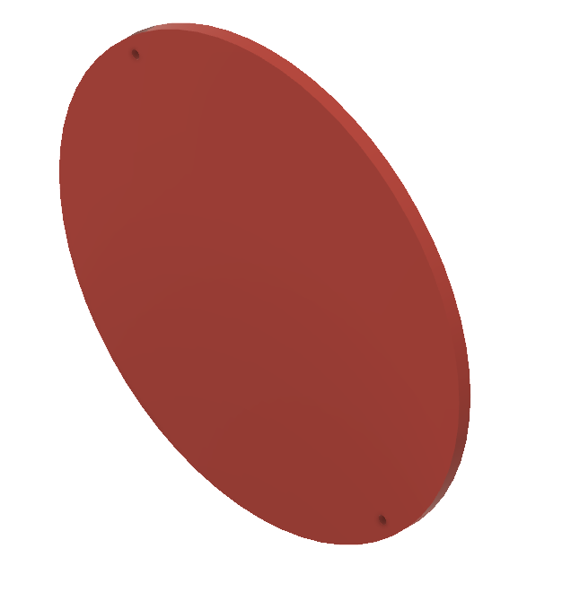
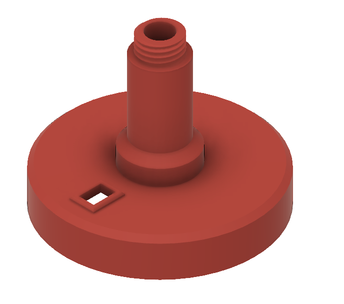
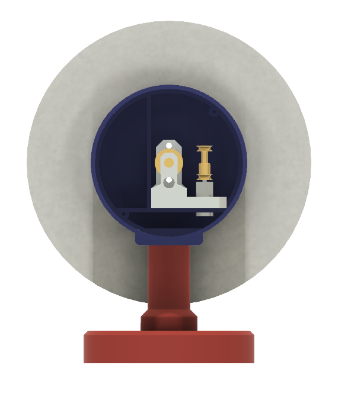

# Moiré clock

Kinetic Art. 

Two rotating discs with a special pattern cause a Moiré effect.

Inspiration from [https://www.youtube.com/watch?v=--O9eyKIubY&t=24s](https://www.youtube.com/watch?v=--O9eyKIubY&t=24s​). 

## Video

Find a [video](https://www.youtube.com/watch?v=r3HTJGnAPmo) here or [here](https://www.youtube.com/watch?v=ZKzjnDaOfy4).

And [somebody](https://www.youtube.com/watch?v=cIzBdA6gmNI&t=55s) got inspired be me.

## Hardware

- [Motor](https://nl.aliexpress.com/item/32891710985.html) - pay attention to RPM (30, 60, 120, ...) and voltage (3V, 6V, 12V)
- [Switch](https://nl.aliexpress.com/item/32921026422.html)
- Battery box [AAA](https://nl.aliexpress.com/item/4001080222745.html) or [AA](https://nl.aliexpress.com/item/1005002137109137.html)

- Special machined parts by [Jan Ridders](https://www.youtube.com/redirect?event=video_description&redir_token=QUFFLUhqbW12V2FkbG1TMWdkT09udENtUGhfNmduVS14QXxBQ3Jtc0ttRWxiSXQ2dnR4ajVVaFM0RHZzcTJ1WWVyV3VsalEtbnlkekV5LXdLUEs3V05YWDhXTURkb3pENXhlRkZxVXZGQkp5RjRreGFtRkZxWXVwbHJsaHZYNUFkMXlJRTY1SlRaWGw0YzA4NExDMWFReXhmRQ&q=http%3A%2F%2Fridders.nu%2FWebpaginas%2Fpagina_moire-art_Maarten%2Fmoire-art_frameset.htm).

## STL files

- [BackDiscWithHub](BackDiscWithHub.stl)    
- [DFrontDiscWithHub](FrontDiscWithHub.stl) 
- [Body](Body.stl)                          
- [Lid](Lid.stl)                            
- [Stand](Stand.stl)                        

## Assembly

(end)

